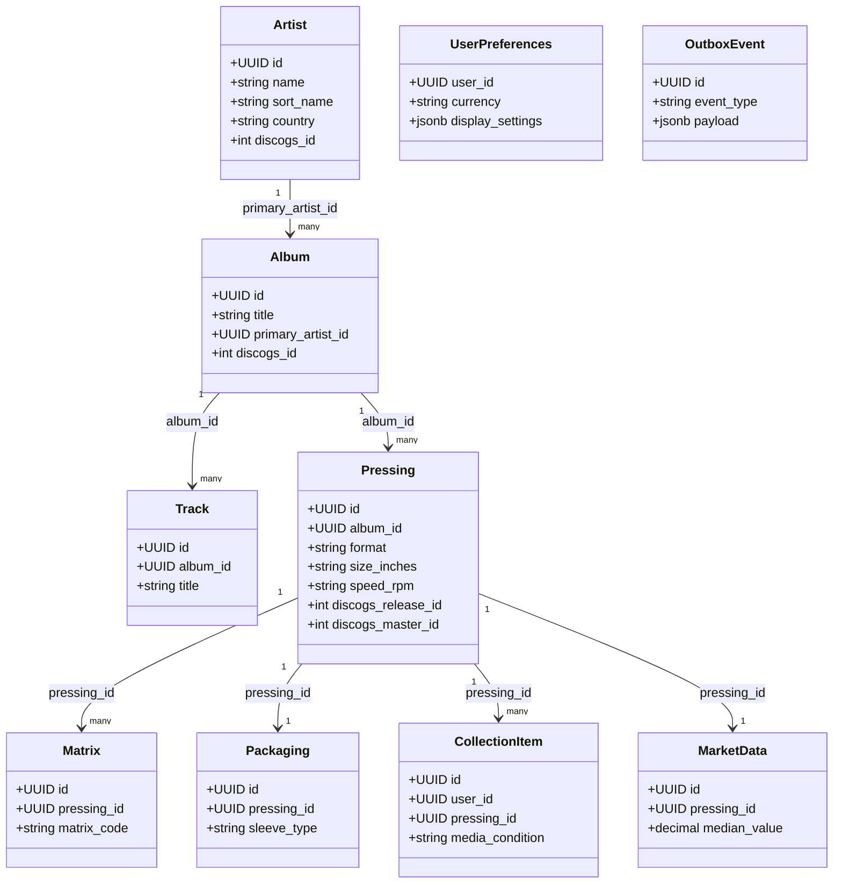
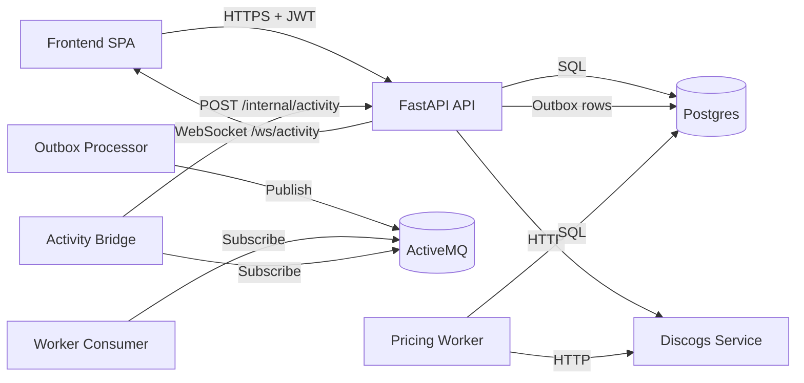
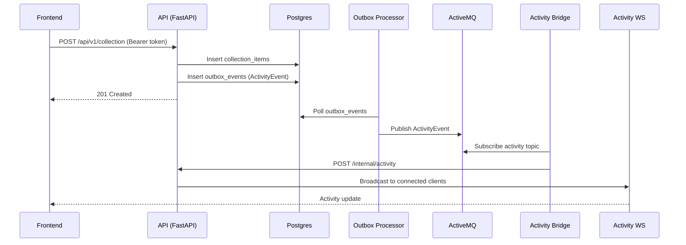
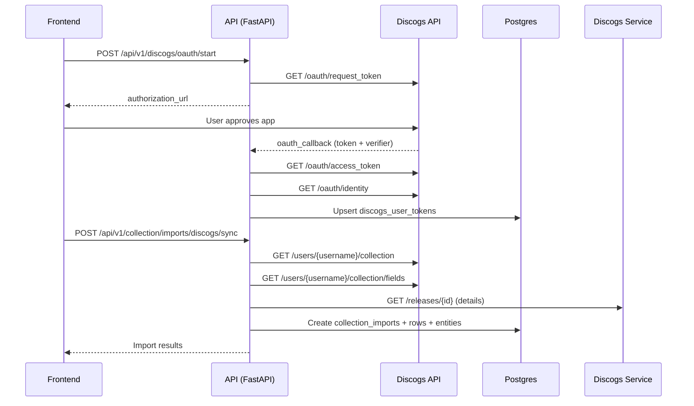
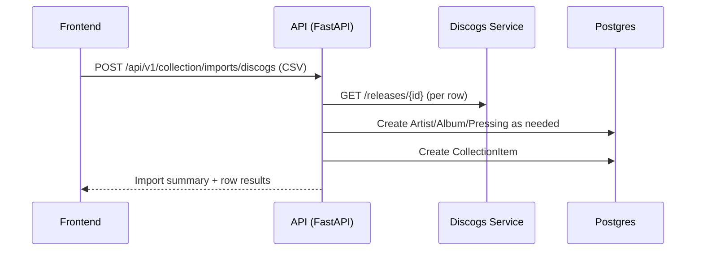

# Application Architecture, Development and Design Guide

## Purpose

This guide explains how MyCousinVinyl is structured, why the architecture looks the way it does, and how to extend it without breaking core constraints. It is derived from the current codebase and database schema, so it can be used as a standalone reference for developers, architects, and technical specialists.

---

## 1. Reference Architecture

### Architectural Style

MyCousinVinyl is a single-page application paired with a hexagonal backend. The frontend is a React (Vite) SPA served by nginx. The backend is a FastAPI service organized into domain, application, ports, adapters, and entrypoints. Additional worker services handle background tasks and integration event processing. Docker Compose is used to orchestrate the services for local and production deployments.

Key patterns in use:

- Hexagonal architecture (domain, application, ports, adapters, entrypoints)
- Repository + Unit of Work for persistence boundaries and transactions
- Transactional outbox for reliable event publishing
- Event-driven integration with ActiveMQ
- HTTP entrypoint boundary for authentication and authorization

### Backend Layering

```
Domain (entities, value objects, events)
  ^ no dependencies
Application (use-case services)
  ^ depends on Domain
Ports (interfaces: repositories, UoW, external clients)
  ^ depends on Application
Adapters (Postgres, ActiveMQ, HTTP clients)
  ^ implements Ports
Entrypoints (FastAPI HTTP, workers)
  ^ orchestrates services
```

### Rationale

- **Security at the boundary** keeps domain logic reusable and testable. Authorization is enforced at the HTTP boundary, not in the domain or application layers.
- **Ports and adapters** isolate infrastructure concerns. You can replace Postgres or ActiveMQ adapters without changing domain or application code.
- **Unit of Work** provides a consistent transactional boundary, ensuring that multi-repository operations commit or roll back together.
- **Outbox pattern** guarantees that integration events are published only after database commits, preventing phantom events.
- **Dedicated workers** separate latency-sensitive user flows from background or batch processing.

---

## 2. Data Model

### Core Entities (from `infrastructure/postgres/init.sql`)

The model separates catalog data (artists, albums, pressings) from user-specific data (collection items, preferences), and adds supporting entities for integration and enrichment.

- **Artist**: musical artists or groups. Includes Discogs IDs, biography, country, images, and aliases.
- **Album**: a master release, independent of pressings. Contains label data, release metadata, and links to genres/styles.
- **Track**: individual tracks tied to an album, including position and duration.
- **Pressing**: a physical release variant (format, size, speed, plant, mastering, color). Stores Discogs release/master IDs.
- **Matrix**: runout or matrix codes for a specific pressing side.
- **Packaging**: sleeve/jacket metadata tied one-to-one with a pressing.
- **CollectionItem**: user-owned copy of a pressing, with condition, purchase, rating, and storage metadata. Always scoped by `user_id`.
- **MarketData**: marketplace pricing data for a pressing (min, median, max, currency, last update).
- **MediaAsset**: images or videos attached to any entity type.
- **ExternalReference**: links to external systems such as Discogs or MusicBrainz.
- **UserPreferences**: user currency and display settings (also stores lightweight profile data for UI).
- **DiscogsOAuthRequest / DiscogsUserToken**: Discogs OAuth and PAT storage for user collection sync.
- **DiscogsCache**: cached Discogs pages and releases to reduce rate limit pressure.
- **CollectionImport / CollectionImportRow**: import job metadata and per-row status.
- **UserFollows**: collection sharing relationships between users.
- **OutboxEvent**: transactional outbox records for event publishing.

### Mermaid UML Diagram (simplified)



### Modifying and Extending the Data Model

When you add new fields or tables, keep the domain model, persistence model, and API contracts aligned:

1. **Update the schema** in `infrastructure/postgres/init.sql`.
2. **Add a migration** in `infrastructure/postgres/migrations/` that mirrors the change.
3. **Update SQLAlchemy models** in `backend/app/adapters/postgres/models.py`.
4. **Update domain entities** in `backend/app/domain/entities.py` if the field is part of business logic or domain invariants.
5. **Update repositories and services** to expose the new data through ports and application services.
6. **Update API schemas** in `backend/app/entrypoints/http/schemas/` and UI models in `frontend/src/types/api.ts` if the field is exposed.

This sequence prevents drift between database, domain, and API layers.

---

## 3. Security Model

### Authentication (Azure Entra ID)

Authentication is handled by Azure Entra ID using MSAL in the frontend and JWT validation in the backend.

- Frontend uses MSAL (`frontend/src/auth/authConfig.ts`) to sign in users and request an access token for the API scope.
- Access tokens are injected into API requests in `frontend/src/api/client.ts`.
- Backend validates tokens in `backend/app/entrypoints/http/auth.py` by:
  - Fetching JWKS keys from Azure
  - Validating signature, issuer, audience, and expiry
  - Extracting `oid` (preferred) or `sub` to derive the user ID

### RBAC Roles

Role-based access control is group-driven and mapped from Azure AD group IDs.

- **Admin**: full access to catalog and settings
- **Editor**: create/edit catalog data and collection items
- **Viewer**: read-only access to catalog and own collection

Role checks are applied at the HTTP boundary using `require_admin`, `require_editor`, and `require_viewer` in `backend/app/entrypoints/http/authorization.py`. Admin inherits Editor and Viewer; Editor inherits Viewer.

### Authorization Implementation

- Authorization is enforced **only** at HTTP entrypoints.
- Application services and domain entities are security-agnostic.
- Workers process trusted internal events without user context.

Collection safety rules:

- All collection operations receive `user_id` from the authenticated context, never from request payloads.
- Repository methods validate ownership for reads and writes involving collection items.

### CORS

CORS is configured in `backend/app/entrypoints/http/main.py`:

- Allowlist: `http://localhost:3000`, `http://localhost:5173`, `https://mcv.cajo.dk`
- Non-production allows any localhost or 127.0.0.1 port via regex
- `allow_credentials=True`, `allow_methods=["*"]`, `allow_headers=["*"]`

---

## 4. Service Description

### Service Inventory

- **frontend**: React SPA built with Vite, served by nginx
- **api**: FastAPI HTTP API implementing hexagonal architecture
- **discogs-service**: FastAPI microservice that wraps the Discogs API
- **worker**: ActiveMQ consumer for background workflows and import automation
- **outbox-processor**: publishes DB outbox events to ActiveMQ
- **pricing-worker**: updates Discogs marketplace pricing into `market_data`
- **cache-cleanup**: cleans expired Discogs cache entries
- **activity-bridge**: forwards ActiveMQ activity events to the API websocket endpoint
- **postgres**: service-owned relational database
- **activemq**: messaging broker

### Service Relationships (Mermaid)



### Major Processes (Mermaid Sequence Diagrams)

#### A) Add a Collection Item and Broadcast Activity



#### B) Discogs OAuth Connect and Sync



#### C) Discogs CSV Import



---

## 5. Discogs Integration

### Authentication

There are two Discogs authentication paths:

1. **Discogs Service (App-level)**  
   `discogs-service` uses one of:
   - OAuth 1.0a token + secret (preferred)
   - Personal Access Token
   - Consumer key/secret as fallback query params

2. **User-level OAuth (Collection Sync)**  
   `backend/app/adapters/http/discogs_oauth_client.py` handles user OAuth, stores tokens in `discogs_user_tokens`, and uses them to sync user collections.

### Discogs Data Alignment

Mapping highlights:

- Discogs **Master** maps to `albums.discogs_id`
- Discogs **Release** maps to `pressings.discogs_release_id`
- Discogs **Master ID** is stored on pressings (`discogs_master_id`, `master_title`)
- Genres and styles from Discogs are mapped to lookup tables
- Label and catalog number map to `albums.label` and `albums.catalog_number_base`
- Pressing metadata (format, speed, size, color, edition type, sleeve type) is derived from Discogs formats and descriptions

### Discogs API Methods Used

Discogs service endpoints:

- `GET /artists/search`
- `GET /artists/{id}`
- `GET /albums/search`
- `GET /albums/{id}` (master or release)
- `GET /masters/{id}/releases`
- `GET /masters/{id}/search`
- `GET /releases/{id}`
- `GET /marketplace/price_suggestions/{release_id}`

Direct Discogs OAuth endpoints (user auth and sync):

- `/oauth/request_token`
- `/oauth/authorize`
- `/oauth/access_token`
- `/oauth/identity`
- `/users/{username}/collection/...`

---

## 6. UX

### General Guidelines

- Dark, high-contrast theme designed for quick scanning of tabular data.
- Tables are the primary data presentation for Artists, Albums, Pressings, and Collection Items.
- Create/edit flows are handled in modal dialogs to keep users in context.
- Emphasis on speed: lightweight filters, quick actions, and minimal navigation depth.

### Layout

- Sticky top navigation with global search and filter controls.
- Main content container max width: 1400px with 2rem padding (1rem on mobile).
- Activity status bar at the bottom (WebSocket-driven).
- Responsive layout collapses navigation and reduces padding under 768px.

### Colors in Use (from CSS)

Text colors:

- Text color normal: `#ffffff` (also used: `#fff`, `#f2f2f2`, `#d8d8d8`)
- Text color muted: `#ccc` (also used: `#cfcfcf`, `#ddd`, `#999`, `#888`, `#777`, `#666`)
- Text color accent: `#ff6b35`
- Text color alert: `#ff4444` (also used: `#ff6b6b`, `#ffcccc`)
- Text color success: `#bfe7c9` (also used: `#c3e6c9`)

Background and surface colors:

- Page background: `#0d0d0d`
- Primary surface: `#1a1a1a`
- Secondary surface: `#121212` (also used: `#151515`, `#1f1f1f`, `#1e1e1e`)
- Elevated surface: `#222` (also used: `#2a2a2a`, `#333`, `#444`)

Accent and state colors:

- Brand accent: `#ff6b35` (hover/active: `#ff8555`)
- Primary action: `#007bff` (hover: `#0056b3`)
- Success action: `#28a745` (hover: `#218838`)
- Warning highlight: `#ffd27a`
- Error background accents: `#2a1515`, `#1a1010`

Teal filter/search theme (navigation filter panel):

- Panel background: `#0c4f52` (inner fields: `#0f3c3f`)
- Panel border: `#11686c` (active: `#37c7c2`)
- Panel actions: `#1db5ae` (active tag: `#79e3dd`)

Supplementary text accents:

- Teal text accents: `#e8ffff`, `#d3f6f2`, `#d1f7f4`, `#c2eeea`, `#063637`, `#041a1a`
- Info text accents: `#b9c9ff`, `#d7e0ff`
- Warning text accent: `#3b2a00`

### MDI Icons in Use

Static imports:

- `mdiAccountMusicOutline`
- `mdiAccountOutline`
- `mdiAlbum`
- `mdiCogOutline`
- `mdiEyeOutline`
- `mdiFilterVariant`
- `mdiInformationBoxOutline`
- `mdiLinkBoxOutline`
- `mdiMagnify`
- `mdiMagnifyScan`
- `mdiMusicBoxOutline`
- `mdiPencilOutline`
- `mdiPlus`
- `mdiTrashCanOutline`

Dynamic icons:

- Collection sharing and profile use dynamic MDI alpha icons (e.g., `mdiAlphaA`, `mdiAlphaABox`, `mdiAlphaACircle`, etc.) as fallbacks and user markers.

---

## 7. Testing

### Unit Testing

Backend unit tests live under `backend/tests/unit` and focus on business logic and orchestration:

- **Domain tests** for entities and value objects
- **Application tests** for services with mocked ports
- **Adapter tests** for integration code with mocked external dependencies

Run unit tests:

```bash
pytest backend/tests/unit/
```

### Integration Testing

Integration tests live under `backend/tests/integration`. They require a running Postgres instance and exercise FastAPI endpoints with authentication stubs.

Run integration tests:

```bash
pytest backend/tests/integration/ -m integration
```

### Frontend Linting

The frontend uses ESLint for static checks:

```bash
cd frontend
npm run lint
```

---
