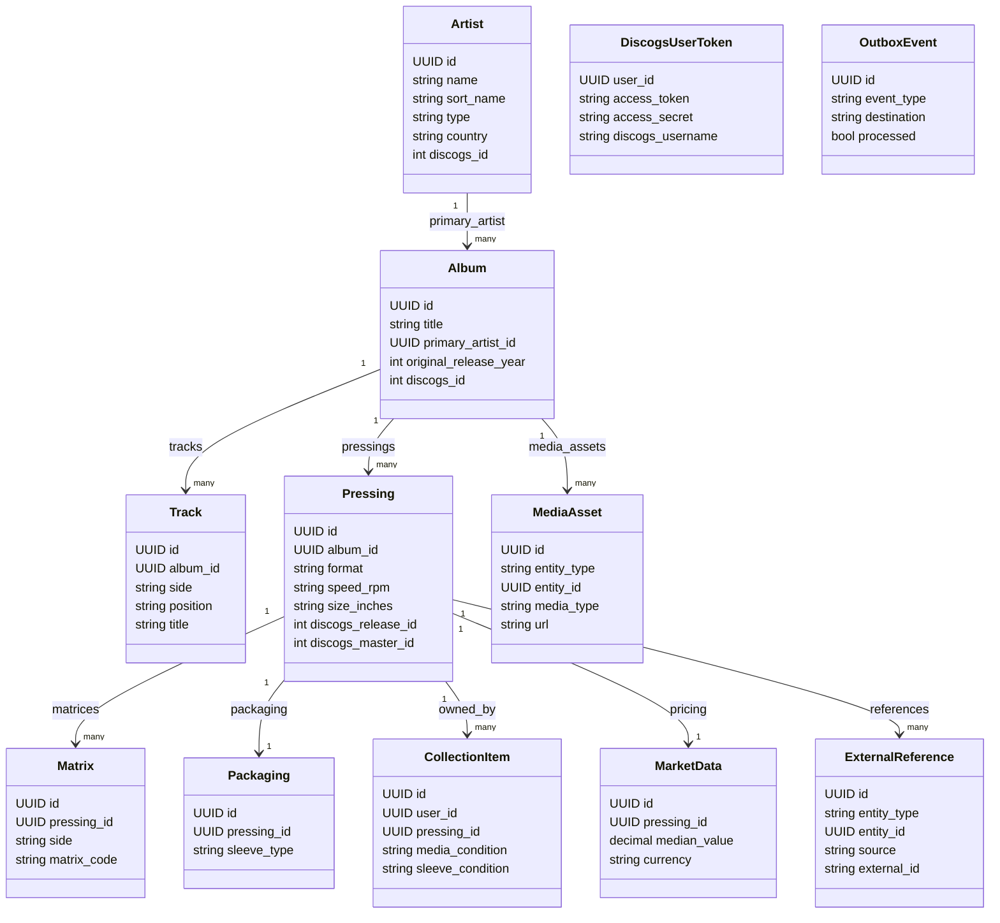
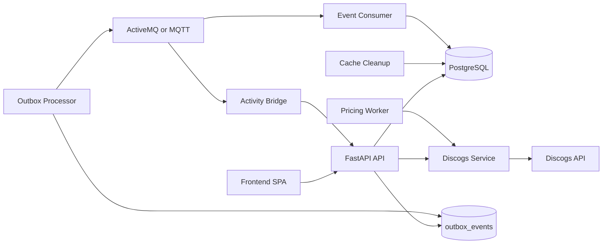
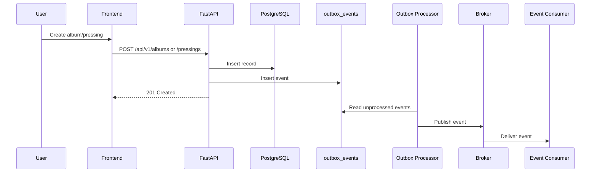
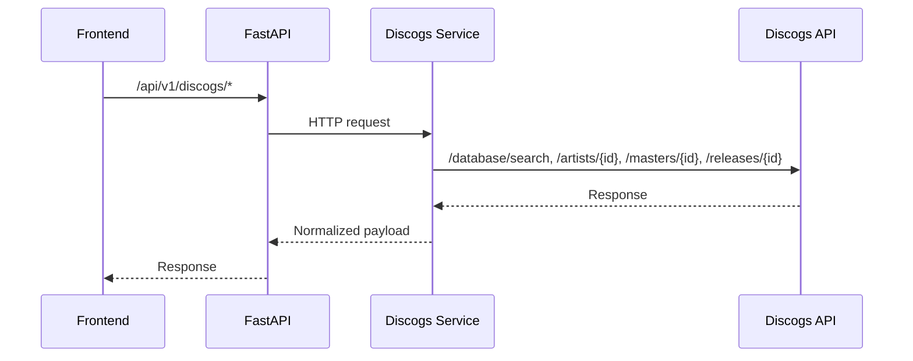
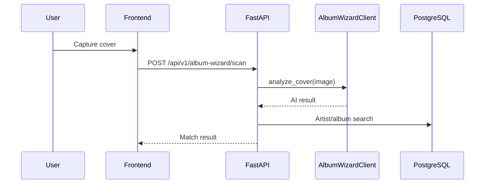

# Application Architecture, Development and Design Guide

## Purpose

This guide enables developers and specialists to work with and extend the application.

## 1. Reference Architecture

### Design patterns in use

- Hexagonal architecture (ports/adapters): domain and application logic in `backend/app/domain` and `backend/app/application`; infrastructure in `backend/app/adapters`; entrypoints in `backend/app/entrypoints`.
- Repository + Unit of Work: repository ports in `backend/app/application/ports`, SQLAlchemy adapters in `backend/app/adapters/postgres`, and `SqlAlchemyUnitOfWork`.
- Transactional outbox: `outbox_events` table and `outbox_processor` worker.
- Event-driven integration: broker abstraction with ActiveMQ/MQTT adapters.
- SPA + API: React SPA in `frontend/` with FastAPI HTTP API in `backend/app/entrypoints/http`.

### Rationale behind design choices

- Isolates domain logic from infrastructure to reduce coupling and enable replacement of storage or messaging.
- Port/adapters allow new integrations (message brokers, storage backends) without changes to core logic.
- Outbox guarantees event publication consistency with database changes.
- Workers keep long-running tasks off request paths and reduce API latency.

## 2. Data Model

### Data structures

The schema is defined in `infrastructure/postgres/init.sql`. Core entities are Artist, Album, Track, Pressing, Matrix, Packaging, and CollectionItem. Supporting entities include MediaAsset, ExternalReference, UserPreferences, MarketData, Discogs OAuth, and Discogs cache tables.



### How to extend the data model

1. Update `infrastructure/postgres/init.sql` with new tables/columns.
2. Update SQLAlchemy models in `backend/app/adapters/postgres/models.py`.
3. Add or update repository ports in `backend/app/application/ports`.
4. Implement repository adapters in `backend/app/adapters/postgres`.
5. Update services and HTTP schemas in `backend/app/application/services` and `backend/app/entrypoints/http/schemas`.
6. Add tests in `backend/tests`.
7. Run migrations if you use Alembic (included in `backend/requirements.txt`).

## 3. Security Model

### Authentication via Azure Entra

- SPA uses MSAL for login.
- API validates JWT access tokens using Azure JWKS, issuer, and audience.
- User identity uses `oid` (preferred) or `sub` claims.

### RBAC roles

- Admin, Editor, Viewer.
- Group IDs are configured in environment variables and mapped in `backend/app/entrypoints/http/authorization.py`.
- Admin inherits Editor and Viewer access.

### Security implementation

- Authorization enforced at HTTP entrypoints only.
- Domain and application layers are security-agnostic.
- Collection operations are scoped by `user_id` in services.

### CORS implementation

- `CORS_ALLOW_ORIGINS` and `CORS_ALLOW_ORIGIN_REGEX` are configurable via environment variables.
- In non-production, a localhost regex is enabled if no regex is provided.
- Implemented in `backend/app/entrypoints/http/main.py`.

## 4. Service Description

### Services

- Frontend SPA (React + Vite): `frontend/`
- API (FastAPI): `backend/app/entrypoints/http`
- Discogs service: `discogs-service/`
- PostgreSQL
- Message broker: ActiveMQ or MQTT
- Outbox processor
- Event consumer worker
- Pricing worker
- Cache cleanup worker
- Activity bridge worker

### Service relationships (Mermaid UML)



### Major flows

#### Catalog create/update and event publish



#### Discogs lookup



#### Album wizard scan



## 5. Discogs Integration

### Authentication

Discogs requests use:

- OAuth 1.0a (token + secret) for user collection features.
- Personal Access Token (PAT) for marketplace pricing.
- Key/secret query params for non-marketplace endpoints.

OAuth and PAT are stored per-user in `discogs_user_tokens`.

### Discogs data model alignment

- Discogs Artist -> `artists`
- Discogs Master -> `albums` (`discogs_id`)
- Discogs Release -> `pressings` (`discogs_release_id`)
- Discogs format/speed/size -> normalized enums

### Discogs API methods used

- `GET /database/search`
- `GET /artists/{id}`
- `GET /masters/{id}`
- `GET /masters/{id}/versions`
- `GET /releases/{id}`
- `GET /marketplace/price_suggestions/{release_id}`

## 6. UX

### General UX guidelines

- Dark theme and high contrast.
- Table-centric browsing for scanning.
- Create/edit via modal dialogs.
- Sticky navigation with quick section access.
- Activity status bar anchored to the bottom on handheld devices.

### Layout

- Top navigation with search and filters.
- Content area constrained to readable width on desktop.
- Mobile layout emphasizes scanning workflows (Album Wizard).

### Colors in use

Foreground:
- Primary text: `#f5f7fa`
- Muted text: `#9a9a9a`

Backgrounds and surfaces:
- App background: `#0b0f14`
- Surface: `#151a1f`
- Surface 2: `#1d232b`
- Border: `rgba(255, 255, 255, 0.08)`
- Accent: `#ff6b35`
- Accent soft: `rgba(255, 107, 53, 0.18)`

### MDI icons in use

- `mdiAlbum`
- `mdiAccountMusicOutline`
- `mdiRecordPlayer`
- `mdiRecordCircleOutline`
- `mdiMusicBoxOutline`
- `mdiMagnify`
- `mdiMagnifyScan`
- `mdiFilterVariant`
- `mdiCamera`
- `mdiCheck`
- `mdiRefresh`
- `mdiPlus`
- `mdiPencilOutline`
- `mdiTrashCanOutline`
- `mdiEyeOutline`
- `mdiInformationBoxOutline`
- `mdiLinkBoxOutline`
- `mdiCog`
- `mdiLogout`
- `mdiMenu`
- `mdiClose`
- `mdiMagicStaff`
- `mdiAccountOutline`
- Dynamic alpha icons: `mdiAlpha{A-Z}`, `mdiAlpha{A-Z}Box`, `mdiAlpha{A-Z}BoxOutline`, `mdiAlpha{A-Z}Circle`, `mdiAlpha{A-Z}CircleOutline`

## 7. Testing

### Unit testing

- Backend unit tests are under `backend/tests/unit`.
- Run with:

```bash
cd backend
pytest
```

### Integration testing

- Integration tests are under `backend/tests/integration`.
- Run with:

```bash
cd backend
pytest tests/integration
```

### Frontend checks

- Linting:

```bash
cd frontend
npm run lint
```
